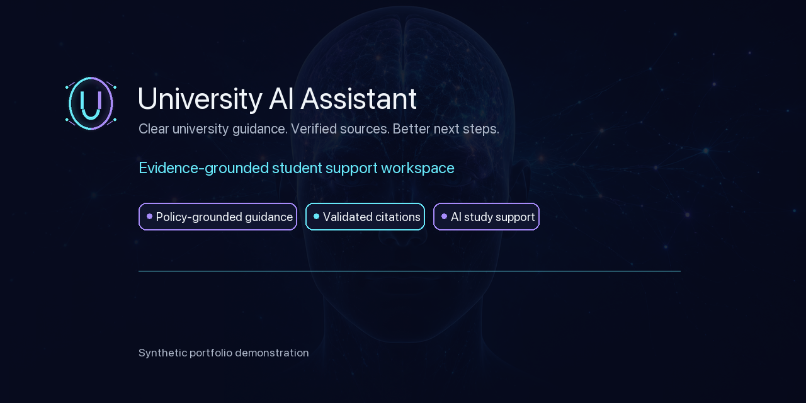
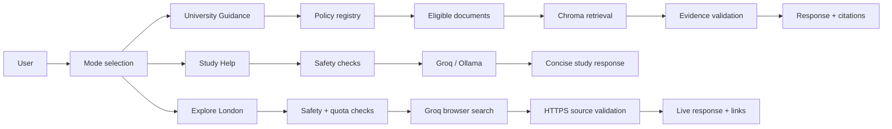

# University AI Assistant

**Clear university guidance. Verified sources. Better next steps.**

Evidence-grounded student support workspace

[**Try the live demo**](https://university-ai-assistant.streamlit.app/)

> **Synthetic portfolio demonstration — not real university policy**

## Product overview

University policies are written for governance, while students often need a clear answer and a practical next step now. University AI Assistant turns controlled, eligible evidence into understandable guidance with validated citations and explicit answer, clarification and refusal pathways.

Unlike a general chatbot, University AI Assistant begins with controlled evidence and only allows the model to explain what it can support.

## Who it is for

- Students looking for a clearer route through university processes
- Student advisers, faculty and student-services teams
- Digital-transformation and responsible-AI teams
- AI product and engineering hiring managers

## How to use it

1. Open the [live application](https://university-ai-assistant.streamlit.app/).
2. Use the mode dropdown above the composer.
3. Choose **University Guidance** for policy-based questions.
4. Choose **Study Help** for explanations, revision planning, brainstorming or writing guidance.
5. Choose **Explore London** for current London places, career fairs and networking events.
6. Type a question and press **Send**.
7. In University Guidance, expand **Validated policy sources** beneath the answer.
8. Select **New chat** when changing topic or starting again.

The dropdown switches application modes, not the underlying Groq model.

## Product modes

| Mode | Best used for | Evidence source | Citations | Important limitation |
|---|---|---|---|---|
| **University Guidance** | University processes and policy questions | Eligible synthetic policy documents | Validated policy citations | Portfolio corpus; human decisions remain necessary |
| **Study Help** | Explanations, revision plans, brainstorming and writing guidance | Configured Groq or local Ollama provider | Not policy citations | Must not invent university rules |
| **Explore London** | London places, opportunities and events | Controlled live browser search | Validated HTTPS source links | Experimental; provider availability and quota apply |

## Example questions

**University Guidance**

- How do I request an assessment extension?
- I was ill for four study days. How should I report it and what evidence is required?
- Is my issue a complaint or an academic appeal?

**Study Help**

- Help me understand opportunity cost.
- Can you make a revision plan for my next exam?
- How can I improve this paragraph’s structure?

**Explore London**

- What free places can I explore in London this weekend?
- Find graduate career events in London next month.
- Are there any AI networking events in London?

## Why it is not just a chatbot

The application uses an eligible policy registry with approval and version controls, retrieves evidence before generation, and constructs citations from validated metadata. Deterministic routing separates answer, clarify and refuse outcomes. Safety boundaries prevent unsupported institutional claims, while human teams remain responsible for approvals, case decisions and outcomes.

## Architecture

## Trust, privacy and safety

- The policy corpus is synthetic; no real student or institutional data is required.
- Raw questions are not logged by default. Instructions inside questions or retrieved documents are untrusted data and cannot override controls.
- Citation identifiers come from validated retrieval metadata, not model invention.
- Legal, visa, medical and emergency advice is outside the supported scope.
- The assistant never promises approval, changed marks or other outcomes; human review remains necessary.
- Groq-hosted modes send the necessary question and supplied evidence to Groq. Local Ollama generation stays local to the configured environment.
- Secrets remain server-side and must never be committed.

## Technology overview

Python 3.12 · Streamlit · Chroma · Sentence Transformers (`all-MiniLM-L6-v2`) · Groq GPT-OSS · Ollama · Markdown policy documents · JSON registry · Pytest · GitHub · Streamlit Community Cloud · custom SVG/CSS visual system

## Synthetic policy coverage

The demonstration corpus covers attendance, planned holiday absence, medical evidence, assessment extensions, mitigation, late submission, complaints, appeals, international attendance procedures, academic misconduct, student conduct and student support.

## Engineering and evaluation

The project has more than 150 automated tests. Deterministic tests avoid real provider calls and cover retrieval, citations, eligibility, provider behaviour, safety routing and UI behaviour. Evaluation fixtures exercise answer, clarification and refusal behaviour. This is not a claim of perfect retrieval accuracy or production certification.

## Current limitations

- Fictional policy corpus and portfolio prototype, not production university guidance
- No institutional authentication, SSO or real university-system integrations
- Retrieval can return related but imperfect evidence
- Hosted generation depends on provider availability and quotas
- Explore London is experimental and depends on live-search access
- No medical, legal, visa or emergency advice

## Roadmap

Institution-controlled policy ingestion; approval and version workflows; SSO and role-based access; university support-directory integrations; privacy-preserving analytics; improved retrieval and reranking evaluation; accessibility and user testing; premium career and city discovery; production security and privacy review.

## Project significance

University AI Assistant demonstrates applied RAG, thoughtful AI product design, responsible-AI controls, provider abstraction, evaluation-driven development, privacy-conscious architecture and end-to-end deployment.

## Source availability

The production implementation is maintained in a private repository. This public repository presents the product, architecture, safeguards and live demonstration.
